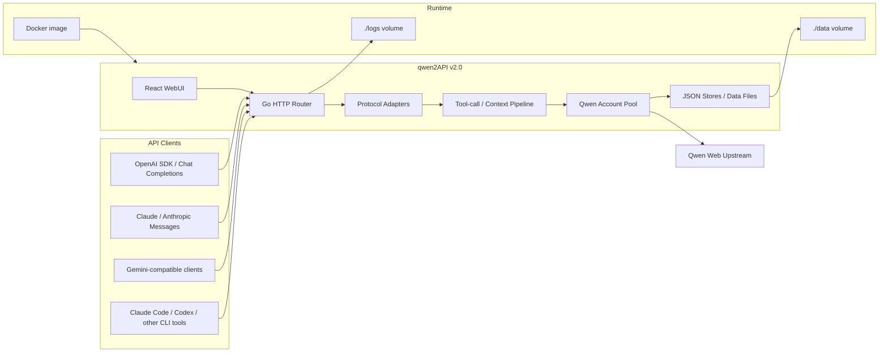

# qwen2API

<p align="center">
  
  
  
  
  
</p>

<p align="center">
  <b>Self-hosted Qwen Web protocol gateway</b><br />
  OpenAI / Anthropic / Gemini compatible APIs, account pool, WebUI, file context, image generation, and video generation.
</p>

<p align="center">
  <a href="./README_CN.md">简体中文</a>
  ·
  <a href="https://hub.docker.com/r/yujunzhixue/qwen2api">Docker Hub</a>
  ·
  <a href="https://github.com/YuJunZhiXue/qwen2API">GitHub</a>
  ·
  <a href="https://t.me/qwen2api">Telegram</a>
</p>

## I. Project Overview

qwen2API converts Qwen Web capabilities into common API protocols and provides a local WebUI for account, API key, runtime, image, and video management.

| Version | Stack | Status |
|---|---|---|
| `v1.0` | Python + FastAPI/Uvicorn | Legacy implementation, kept only as historical context. |
| `v2.0` | Go backend + React WebUI | Current mainline, faster startup, simpler runtime, Docker-first deployment. |

Main capabilities:

- OpenAI-compatible endpoints: `/v1/chat/completions`, `/v1/responses`, `/v1/models`, `/v1/files`, `/v1/images/generations`, `/v1/videos/generations`.
- Anthropic-compatible endpoints: `/v1/messages`, `/anthropic/v1/messages`, `/v1/messages/count_tokens`.
- Gemini-compatible endpoints: `/v1beta/models/{model}:generateContent`, `/v1beta/models/{model}:streamGenerateContent`.
- WebUI management for Qwen accounts, downstream API keys, runtime settings, model tests, image tests, and video tests.
- Multi-account pool with per-account concurrency controls and separate chat/image/video rate-limit cooldowns.
- Runtime probes: `/healthz`, `/readyz`, `/keepalive`.

## II. Architecture



Runtime path rules:

- Docker stores data inside the container at `/app/data` and logs at `/app/logs`.
- The default compose file maps those paths to `./data` and `./logs` in your current host directory.
- For local non-Docker runs, empty path environment variables fall back to the current project directory.

## III. Docker Deployment

### 1. Pull From Docker Hub With Compose

This is the recommended server deployment path. Create a directory, write a compose YAML that points to the Docker Hub image, pull the image, then start it.

```bash
mkdir qwen2api
cd qwen2api
mkdir -p data logs
```

Create `.env`:

```env
HOST_PORT=7860
HOST_DATA_DIR=./data
HOST_LOGS_DIR=./logs
ADMIN_KEY=change-this-to-a-strong-random-key
```

Create `docker-compose.yml`:

```yaml
services:
  qwen2api:
    image: ${QWEN2API_IMAGE:-yujunzhixue/qwen2api:latest}
    container_name: qwen2api
    restart: unless-stopped
    init: true
    env_file:
      - path: .env
        required: false
    ports:
      - "${HOST_PORT:-7860}:${PORT:-7860}"
    volumes:
      - ${HOST_DATA_DIR:-./data}:/app/data
      - ${HOST_LOGS_DIR:-./logs}:/app/logs
    shm_size: "512m"
    environment:
      BASE_DIR: /app
      DATA_DIR: /app/data
      LOGS_DIR: /app/logs
      ACCOUNTS_FILE: /app/data/accounts.json
      USERS_FILE: /app/data/users.json
      CAPTURES_FILE: /app/data/captures.json
      CONFIG_FILE: /app/data/config.json
      API_KEYS_FILE: /app/data/api_keys.json
      CONTEXT_GENERATED_DIR: /app/data/context_files
      CONTEXT_CACHE_FILE: /app/data/context_cache.json
      UPLOADED_FILES_FILE: /app/data/uploaded_files.json
      CONTEXT_AFFINITY_FILE: /app/data/session_affinity.json
    healthcheck:
      test: ["CMD-SHELL", "curl -fsS http://127.0.0.1:${PORT:-7860}/healthz || exit 1"]
      interval: 30s
      timeout: 10s
      start_period: 120s
      retries: 3
```

Pull and start:

```bash
docker compose pull
docker compose up -d
docker compose logs -f qwen2api
```

Open:

- WebUI: `http://127.0.0.1:7860`
- Health check: `http://127.0.0.1:7860/healthz`
- Keepalive probe: `http://127.0.0.1:7860/keepalive`

### 2. Build Locally With Docker

Use this when you changed the source code and want to run your own local image.

```bash
git clone https://github.com/YuJunZhiXue/qwen2API.git
cd qwen2API
cp .env.example .env
docker compose -f docker-compose.yml -f docker-compose.build.yml build
docker compose -f docker-compose.yml -f docker-compose.build.yml up -d
```

### 3. Publish Docker Images With GitHub Actions

The repository includes `.github/workflows/docker-publish.yml`.

- Push to `main`: builds `latest` and `sha-*`.
- Push `v*.*.*` tags: builds semver tags.
- Pushes to GHCR by default: `ghcr.io/yujunzhixue/qwen2api`.
- Also pushes to Docker Hub when `DOCKERHUB_USERNAME` and `DOCKERHUB_TOKEN` repository secrets are configured.

## IV. Configuration

Do not commit real secrets. `.env.example` intentionally contains empty values and commented examples only.

| Variable | Description |
|---|---|
| `ADMIN_KEY` | WebUI and `/api/admin/*` management key. Set a strong private value. |
| `QWEN_API_KEY`, `QWEN_API_KEYS`, `QWEN_API_KEY_N` | Runtime-only downstream API keys injected from env. They are not saved to `data/api_keys.json` and cannot be deleted from WebUI. |
| `QWEN_ACCOUNT_N` | Runtime-only upstream Qwen account, format `token;optional-email;optional-password`. It is not saved to `data/accounts.json`. |
| `KEEPALIVE_URL`, `KEEPALIVE_INTERVAL` | Optional background keepalive task. Env values lock the same WebUI settings. |
| `HOST_DATA_DIR`, `HOST_LOGS_DIR` | Host paths mounted into Docker as `/app/data` and `/app/logs`. Defaults are `./data` and `./logs`. |
| `DATA_DIR`, `LOGS_DIR` | Local non-Docker path overrides. Leave empty to use the current project directory. |

Default data files:

- `data/accounts.json`: Qwen accounts added from WebUI.
- `data/api_keys.json`: downstream API keys created from WebUI.
- `data/config.json`: runtime settings such as keepalive config.
- `data/context_files/`: generated context files.
- `logs/`: runtime logs.

## V. Development Guide

### 1. Requirements

- Go `1.26`
- Node.js `20+`
- npm
- Docker, only if you need container builds

### 2. One-Command Local Startup

```powershell
go run start-all.go
```

### 3. Backend Development

```powershell
cd backend
go run .
```

Verification:

```powershell
cd backend
go test ./...
go build -trimpath -ldflags="-s -w" -o ..\bin\qwen2api-backend.exe .
```

### 4. Frontend Development

```powershell
cd frontend
npm ci
npm run dev
```

Production build:

```powershell
cd frontend
npm run build
```

### 5. Development Rules

- Keep the Go backend as the v2.0 runtime source of truth.
- Do not reintroduce Python/FastAPI runtime files into the Go mainline.
- Keep Docker data paths container-internal as `/app/data` and `/app/logs`; host paths should be controlled by compose volume mappings.
- Do not commit `data/`, `logs/`, `.env`, real tokens, cookies, passwords, or downstream API keys.
- Update README and `.env.example` when adding user-visible configuration.

## VI. Contribution

Contributions are welcome.

- Report bugs through GitHub Issues.
- Submit feature requests through GitHub Issues.
- Open pull requests for fixes and improvements.
- Keep changes focused and include verification steps when possible.

Recommended pull request checklist:

- `go test ./...` passes in `backend`.
- `npm run build` passes in `frontend`.
- Docker-related changes are reflected in `Dockerfile`, `docker-compose.yml`, and documentation.
- No generated data, logs, or secrets are included.

## VII. Other Information

### License

GPL-3.0

### Acknowledgements

- 特别鸣谢: [LinuxDo](https://linux.do/)
